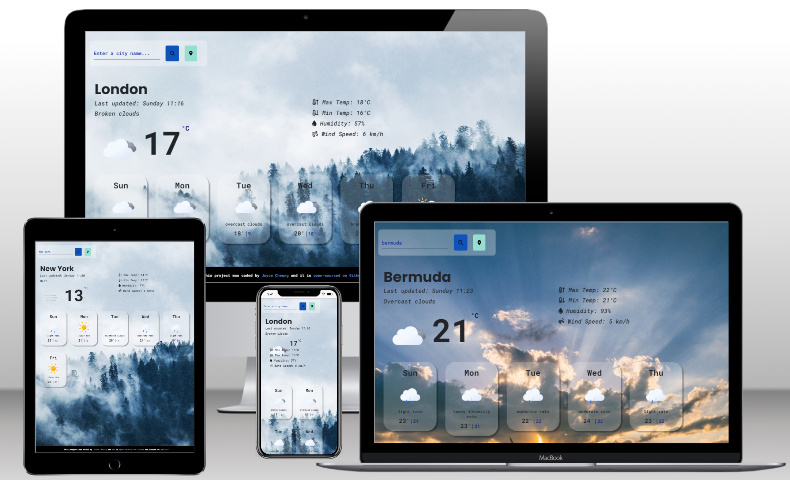

# Weather App

The Weather Application was created for the Shecodes Plus Project

## Introduction

A simple weather application that displays the current weather and daily forecasts based on geolocation or search.

[View the live project here.](https://weatherjs88.netlify.app/)

My approach for designing this weather application was to create it so that it is not only accessible to view on desktop but it is also mobile responsive. The applicaion is also accessible through a range of different devices.

## Features

- User can type in any city/countries in the world to search for a six day forecast
- Shows weather based on your geo location
- Shows animated weather Icons for each day
- Background images changes depending on the weather temperature for example if they city/country the user selected is < 0 a snowing background image will be shown. If the temperature is > 19 a sunny background image will be shown etc.

## Usage

- Visit https://weatherjs88.netlify.app/
- Type a city/country of your choice in the search bar
- Press the "Enter" button to search for the city or click on the search Icon.
- View the six day forecast for that city/country
- Hover over each day to get a better view of the max/min temperatures

# Frameworks & Programs Used

- Google Fonts One: [Roboto Mono](https://fonts.google.com/specimen/Roboto+Mono?query=roboto+mono)
- Google Fonts Two: [Poppins](https://fonts.google.com/specimen/Poppins?query=poppins)
- Animated weather Icons: [Meteocons](https://bas.dev/work/meteocons)
- Weather API used: [Openweathermap.org api](https://openweathermap.org/api)

# Credit

- Animated weather Icons was taken from [Meteocons](https://bas.dev/work/meteocons) designed by [Basmilius](https://bas.dev/)

  
